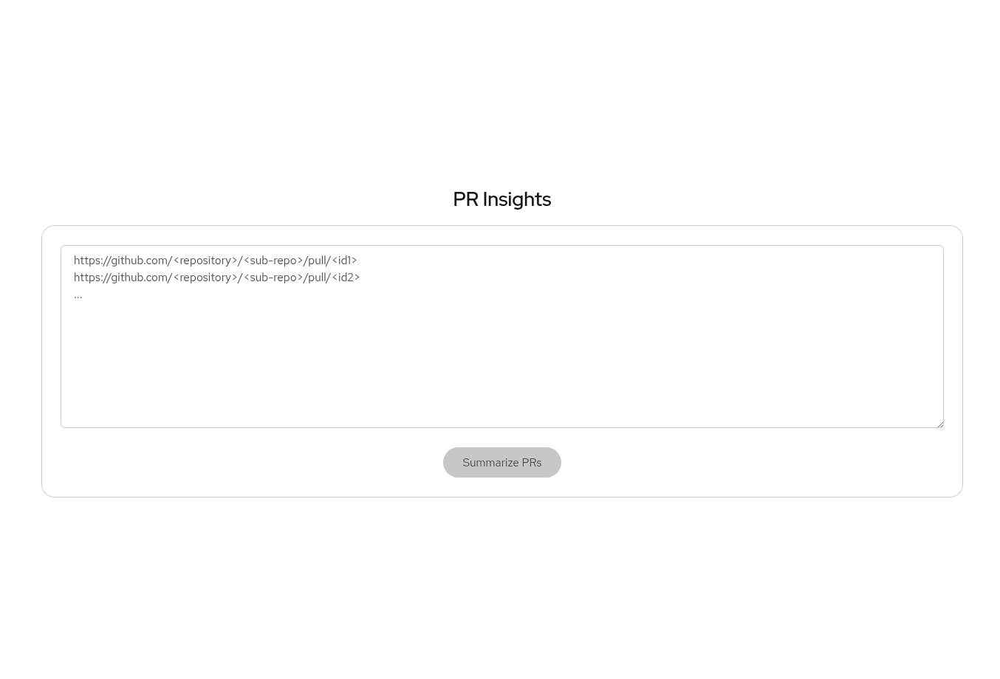

# PR Insight

**PR Insight** is a web application built with **React** and **TypeScript** that leverages the **GitHub API** and **Gemini AI** to generate clear, concise summaries of GitHub Pull Requests.



## 🔍 Overview

Given a list of GitHub Pull Requests, PR Insight:

- Fetches the **title** and **description** of each PR using the GitHub API.
- Uses **Gemini AI** to generate a high-quality summary for each PR.
- Automatically adjusts the summary’s tone based on the PR’s status:
  - **Merged** PRs are summarized in the **past tense** (e.g., "This PR added support for...").
  - **WIP (Work In Progress)** PRs are summarized in the **present tense** (e.g., "This PR adds support for...").

This helps teams quickly understand the context and scope of pull requests during code reviews or status updates.

## 🚀 Features

- 📦 GitHub integration for real-time PR data
- 🤖 AI-powered summarization with Gemini AI
- 🧠 Smart tense adjustment based on PR state
- 🧼 Clean and user-friendly UI built with React + TypeScript + PatternFly 6

## 🛠️ Tech Stack

- **Frontend**: React, TypeScript
- **UI**: PatternFly 6
- **AI Integration**: Gemini API
- **Data Source**: GitHub REST API

## 🔧 Setup Instructions

1. **Clone the repository**  
   ```bash
   git clone https://github.com/your-username/pr-summarizer.git
   cd pr-summarizer
   ```
2. **Install dependencies**
  ```bash
  npm install
  ``` 
3. **Set up environment variables**
  Create a `.env` file with the following variables:
  ```bash
  REACT_APP_GITHUB_TOKEN=your_github_token
  REACT_APP_GEMINI_API_KEY=your_gemini_api_key
  ``` 
4. **Run the app**
  ```bash
  npm run dev
  ```

## 📘 Example Output
### Input
> https://github.com/freeipa/freeipa-webui/pull/735
> https://github.com/freeipa/freeipa-webui/pull/733
> https://github.com/freeipa/freeipa-webui/pull/731

### Output
> - A unit test was added for the `DataSpinner` component, which was also exposed via an index file to support testing, and the project version was bumped. (https://github.com/freeipa/freeipa-webui/pull/735)
> - The pull request fixed intermittent "as whom" test failures by narrowing the CSS selector for dual list items to prevent context collisions and flakiness (https://github.com/freeipa/freeipa-webui/pull/733).
> - This pull request bumped the project version from 0.1.4 to 0.1.5 in package.json. (https://github.com/freeipa/freeipa-webui/pull/731)

## 📄 License
MIT License